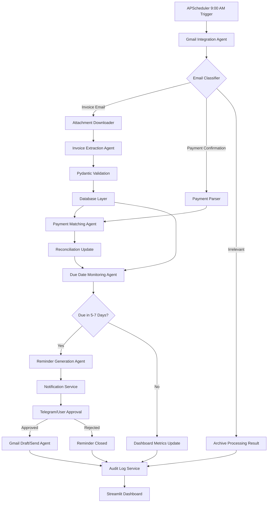
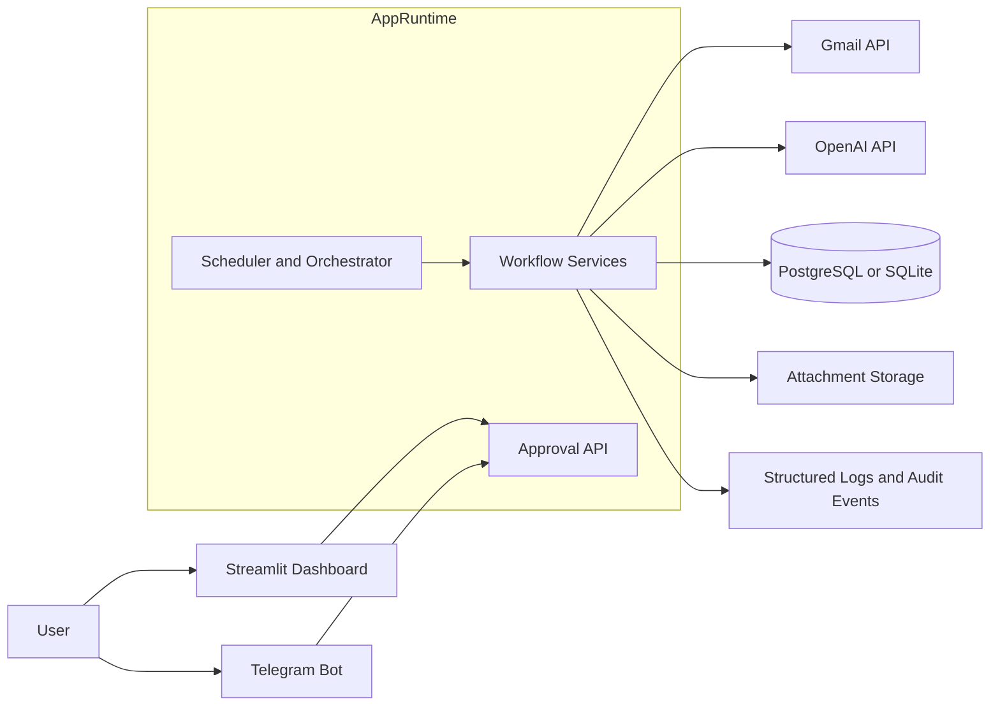
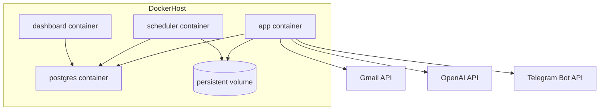

# Invoice Intelligence Agent - Architecture Document

## 1. Purpose

This document defines the target architecture for a production-grade Invoice Intelligence Agent that:

- scans Gmail automatically every day at 9:00 AM with no daily user interaction,
- detects invoice and payment confirmation emails,
- downloads invoice PDF attachments,
- extracts structured invoice data,
- stores data in SQL,
- matches payments to invoices,
- monitors due dates,
- generates payment reminder drafts,
- requests user approval before any outbound email is sent,
- keeps audit logs,
- surfaces dashboard metrics, and
- remains ready for future migration to PostgreSQL and LangGraph multi-agent orchestration.

This is an architecture-first deliverable. No application code is defined here yet.

---

## 2. Architectural Principles

1. **Automation with controlled approval**  
   Email intake, classification, extraction, matching, and reminder draft generation are automated. Outbound email delivery is always gated by explicit user approval.

2. **Modular monolith first, service-ready later**  
   Start with a Python 3.11 modular monolith to reduce operational complexity. Design module interfaces so components can later be split into services if scale or compliance requires it.

3. **Database portability by design**  
   Use SQLAlchemy ORM, repositories, and Alembic-compatible migrations so SQLite works for local and small deployments, while PostgreSQL becomes the preferred production target.

4. **Class-based now, LangGraph-ready next**  
   The first implementation can use Python service classes. Those services must expose clean tool-like interfaces so a future LangGraph state machine can orchestrate the same capabilities with minimal refactoring.

5. **Auditability and traceability**  
   Every meaningful action must emit structured logs and persist an audit event record when it affects business state or user communication.

6. **Least privilege and secure secret handling**  
   Gmail OAuth scopes, OpenAI keys, Telegram tokens, and database credentials must be tightly scoped, centrally configured, and never hard-coded.

---

## 3. Business Flow Overview

### Daily autonomous cycle at 9:00 AM

1. APScheduler triggers the daily inbox scan job at 9:00 AM in the configured business timezone.
2. Gmail integration retrieves unread or newly relevant emails from the Inbox and selected labels.
3. Email classifier identifies:
   - invoice emails,
   - payment confirmation emails,
   - irrelevant emails.
4. Invoice emails with PDF attachments are stored as source artifacts and queued for extraction.
5. Invoice extraction parses text/OCR and produces structured invoice data.
6. Structured invoice data is validated with Pydantic and persisted through the database layer.
7. Payment confirmation emails are parsed into payment events.
8. Payment matching links payment events to invoices using deterministic and heuristic logic.
9. Due date monitor identifies invoices due in the next 5-7 days and overdue invoices.
10. Reminder generation creates draft reminders for invoices that are due soon and still unpaid.
11. Notification service sends approval requests to the user via Telegram and/or dashboard notifications.
12. Only after approval, Gmail draft/send actions are executed.
13. Dashboard metrics and audit logs are updated.

### One-time user interaction assumption

The system does not require daily user interaction, but it **does require initial OAuth consent** and ongoing approval only when a reminder is proposed for sending.

---

## 4. Target Repository Structure

```text
invoice-intelligence-agent/
├── README.md
├── docs/
│   ├── architecture.md
│   ├── decisions/
│   │   ├── adr-001-modular-monolith.md
│   │   ├── adr-002-sqlalchemy-repository-pattern.md
│   │   └── adr-003-langgraph-migration-strategy.md
│   ├── diagrams/
│   │   ├── agent-interaction.mmd
│   │   ├── deployment-architecture.mmd
│   │   └── docker-architecture.mmd
│   └── runbooks/
│       ├── oauth-setup.md
│       ├── incident-response.md
│       └── production-operations.md
├── src/
│   └── invoice_agent/
│       ├── __init__.py
│       ├── config/
│       │   ├── settings.py
│       │   ├── logging.py
│       │   └── security.py
│       ├── domain/
│       │   ├── entities/
│       │   │   ├── email_message.py
│       │   │   ├── invoice.py
│       │   │   ├── payment.py
│       │   │   ├── reminder.py
│       │   │   └── audit_event.py
│       │   ├── value_objects/
│       │   │   ├── money.py
│       │   │   ├── due_window.py
│       │   │   └── match_score.py
│       │   └── enums.py
│       ├── schemas/
│       │   ├── email.py
│       │   ├── invoice.py
│       │   ├── payment.py
│       │   ├── reminder.py
│       │   └── dashboard.py
│       ├── integrations/
│       │   ├── gmail/
│       │   │   ├── auth.py
│       │   │   ├── client.py
│       │   │   ├── inbox_reader.py
│       │   │   ├── attachment_downloader.py
│       │   │   └── draft_sender.py
│       │   ├── openai/
│       │   │   ├── client.py
│       │   │   └── structured_extraction.py
│       │   └── telegram/
│       │       ├── bot_client.py
│       │       └── approval_notifier.py
│       ├── db/
│       │   ├── base.py
│       │   ├── session.py
│       │   ├── models/
│       │   │   ├── email_record.py
│       │   │   ├── invoice_record.py
│       │   │   ├── payment_record.py
│       │   │   ├── reminder_record.py
│       │   │   ├── audit_event_record.py
│       │   │   └── dashboard_snapshot_record.py
│       │   ├── repositories/
│       │   │   ├── emails.py
│       │   │   ├── invoices.py
│       │   │   ├── payments.py
│       │   │   ├── reminders.py
│       │   │   └── audits.py
│       │   └── migrations/
│       ├── services/
│       │   ├── gmail_integration/
│       │   │   ├── email_ingestion_service.py
│       │   │   └── email_classification_service.py
│       │   ├── invoice_extraction/
│       │   │   ├── pdf_parser_service.py
│       │   │   ├── extraction_service.py
│       │   │   └── validation_service.py
│       │   ├── payment_matching/
│       │   │   ├── payment_parser_service.py
│       │   │   ├── matching_service.py
│       │   │   └── reconciliation_service.py
│       │   ├── due_date_monitoring/
│       │   │   ├── due_date_service.py
│       │   │   └── reminder_candidate_service.py
│       │   ├── reminder_generation/
│       │   │   ├── reminder_draft_service.py
│       │   │   └── template_service.py
│       │   ├── notification/
│       │   │   ├── approval_service.py
│       │   │   └── notification_service.py
│       │   ├── dashboard/
│       │   │   ├── metrics_service.py
│       │   │   └── snapshot_service.py
│       │   └── audit/
│       │       └── audit_log_service.py
│       ├── workflows/
│       │   ├── orchestration/
│       │   │   ├── daily_scan_workflow.py
│       │   │   ├── payment_reconciliation_workflow.py
│       │   │   └── reminder_approval_workflow.py
│       │   └── langgraph/
│       │       ├── state.py
│       │       ├── nodes.py
│       │       ├── edges.py
│       │       └── graph_builder.py
│       ├── scheduler/
│       │   ├── jobs.py
│       │   ├── triggers.py
│       │   └── bootstrap.py
│       ├── dashboard/
│       │   ├── app.py
│       │   ├── pages/
│       │   │   ├── 1_overview.py
│       │   │   ├── 2_invoices.py
│       │   │   ├── 3_payments.py
│       │   │   ├── 4_reminders.py
│       │   │   └── 5_audit_logs.py
│       │   └── components/
│       ├── api/
│       │   ├── health.py
│       │   ├── approvals.py
│       │   └── webhooks.py
│       └── utils/
│           ├── time.py
│           ├── idempotency.py
│           ├── hashing.py
│           └── file_storage.py
├── tests/
│   ├── unit/
│   ├── integration/
│   ├── contract/
│   └── fixtures/
├── storage/
│   ├── raw_emails/
│   ├── attachments/
│   └── exports/
├── scripts/
│   ├── bootstrap_local.sh
│   ├── seed_demo_data.py
│   └── rotate_tokens.py
├── .env.example
├── requirements.txt
├── pyproject.toml
├── Dockerfile
├── docker-compose.yml
├── alembic.ini
└── .github/
    └── workflows/
        ├── ci.yml
        ├── docker.yml
        └── release.yml
```

---

## 5. Folder-by-Folder Explanation

### `/docs`
Architecture, ADRs, diagrams, setup instructions, and operational runbooks. This is the primary knowledge base for design and operations.

### `/src/invoice_agent/config`
Centralized configuration, settings loading, logging policies, and security settings. Keeps environment-specific behavior outside business logic.

### `/src/invoice_agent/domain`
Pure business concepts and rules that should not depend on infrastructure frameworks. This layer protects future migration flexibility.

### `/src/invoice_agent/schemas`
Pydantic request, response, and structured extraction schemas. These enforce data contracts between modules and external APIs.

### `/src/invoice_agent/integrations`
Adapters for Gmail, OpenAI, and Telegram. This layer isolates vendor-specific logic from core business workflows.

### `/src/invoice_agent/db`
SQLAlchemy models, session management, repository interfaces, and migrations. Designed to support both SQLite and PostgreSQL with minimal business-layer change.

### `/src/invoice_agent/services`
Application services grouped by capability:

- **gmail_integration**: email retrieval, label handling, attachment handling, classification initiation.
- **invoice_extraction**: PDF parsing, structured extraction, validation, persistence preparation.
- **payment_matching**: payment event parsing, invoice-payment linking, reconciliation status management.
- **due_date_monitoring**: due window computation, candidate generation for reminders.
- **reminder_generation**: draft body generation, template management, subject line creation.
- **notification**: approval request delivery, status handling, Telegram interactions.
- **dashboard**: aggregate metrics, dashboard queries, trend snapshots.
- **audit**: immutable business event tracking.

### `/src/invoice_agent/workflows/orchestration`
Current class-based orchestration layer. Encapsulates end-to-end daily scan, reconciliation, and reminder approval flows without coupling the app to LangGraph too early.

### `/src/invoice_agent/workflows/langgraph`
Future-ready workflow layer that maps existing services into LangGraph nodes and shared state. This allows incremental migration rather than a rewrite.

### `/src/invoice_agent/scheduler`
APScheduler bootstrap and job registration. Responsible for triggering the 9:00 AM scan and optional secondary maintenance jobs.

### `/src/invoice_agent/dashboard`
Streamlit dashboard for invoice status, reminders, payment matching, and audit visibility.

### `/src/invoice_agent/api`
Thin API surface for health checks, approval actions, and webhook-style integrations if needed later.

### `/src/invoice_agent/utils`
Cross-cutting utilities such as idempotency keys, safe file paths, time normalization, and hashes for deduplication.

### `/tests`
Unit, integration, and contract tests. Contract tests are important for stable migration from class-based services to LangGraph nodes.

### `/storage`
Managed local artifact storage for raw emails, downloaded attachments, and generated exports. In future deployments this can map to object storage.

### `/scripts`
Operational utilities for local bootstrap, demo setup, and controlled token maintenance.

### Root config files

- **requirements.txt**: pip-compatible dependency list for deployment and runtime installs.
- **pyproject.toml**: Python project metadata and dependency management.
- **Dockerfile** / **docker-compose.yml**: containerization and local multi-container orchestration.
- **alembic.ini**: migration configuration.
- **.github/workflows**: CI/CD pipelines.

---

## 6. Module Architecture

## 6.1 Gmail Integration Module

**Responsibilities**

- Gmail OAuth flow and refresh token handling
- Inbox scanning at scheduled times
- Reading email metadata and message bodies
- Downloading PDF attachments
- Creating reminder drafts
- Sending approved reminders

**Key design choices**

- Use Gmail OAuth with offline access so refresh tokens can support unattended daily scans.
- Restrict scopes to the minimum needed, ideally:
  - read inbox content,
  - create drafts,
  - send approved drafts.
- Persist Gmail message IDs, thread IDs, attachment IDs, and label state for idempotency.

## 6.2 Database Layer Module

**Responsibilities**

- SQLAlchemy engine/session setup
- ORM model definitions
- repository pattern
- migration support
- transaction boundaries

**Portability strategy**

- SQLite for local/small deployments
- PostgreSQL for production
- Avoid SQLite-specific SQL in business logic
- Use SQLAlchemy types and query patterns that behave consistently on both backends

## 6.3 Invoice Extraction Module

**Responsibilities**

- Parse PDF text directly when possible
- Detect scanned PDFs and route through OCR/LLM-assisted extraction
- Use OpenAI for structured extraction into Pydantic schemas
- Validate required fields before persistence

**Extraction outputs**

- vendor name
- invoice number
- invoice date
- due date
- currency
- total amount
- tax amount
- line items when available
- payment terms
- bank/payment reference if present

## 6.4 Payment Matching Module

**Responsibilities**

- Parse payment confirmation emails into structured payment events
- Match payments to invoices
- support one-to-one, one-to-many, and partial payment cases
- maintain match confidence and review status

**Matching strategy**

1. Deterministic match by invoice number
2. Match by payment reference / transaction reference
3. Match by vendor + amount + date proximity
4. Heuristic fallback with confidence score
5. Manual review queue when confidence is below threshold

## 6.5 Due Date Monitoring Module

**Responsibilities**

- Compute due status per invoice
- identify invoices due in the next configurable 5-7 day window
- identify overdue invoices
- avoid duplicate reminder proposals within a cooldown window

## 6.6 Reminder Generation Module

**Responsibilities**

- Produce reminder email drafts
- personalize content using invoice and vendor data
- support configurable templates and tone
- attach traceable reminder metadata

**Policy**

- drafts can be generated automatically
- drafts cannot be sent automatically
- every send requires explicit user approval

## 6.7 Notification Service Module

**Responsibilities**

- notify the user that approval is needed
- provide Telegram approval links/buttons and dashboard actions
- record approval decisions and timestamps

**Notification channels**

- Telegram Bot API for real-time alerts
- Streamlit dashboard notification center
- optional email summary later if needed

## 6.8 Dashboard Module

**Responsibilities**

- outstanding invoice totals
- due-soon invoice counts
- overdue counts
- payment match rates
- reminder pipeline status
- audit trail browsing
- processing failure visibility

## 6.9 Scheduler Module

**Responsibilities**

- execute the daily Gmail scan at 9:00 AM
- trigger maintenance jobs such as token health checks, retries, and daily metric snapshot generation

**Scheduling rule**

- primary job runs at 9:00 AM in a configured timezone
- idempotency guard prevents duplicate execution if multiple scheduler instances start accidentally

## 6.10 LangGraph Workflow Module

**Responsibilities**

- express workflow nodes and edges once the system evolves beyond class orchestration
- retain shared state across email intake, extraction, matching, and reminder generation
- support retries, branching, and human approval checkpoints

---

## 7. Proposed Database Schema

## 7.1 Core Entities

### `gmail_accounts`

| Column | Type | Notes |
|---|---|---|
| id | UUID / integer | primary key |
| email_address | string | unique |
| oauth_access_token | text | encrypted at rest |
| oauth_refresh_token | text | encrypted at rest |
| token_expiry_at | datetime | refresh management |
| scopes | text/json | granted scopes |
| created_at | datetime | audit |
| updated_at | datetime | audit |

### `email_messages`

| Column | Type | Notes |
|---|---|---|
| id | UUID / integer | primary key |
| gmail_account_id | FK | owner mailbox |
| gmail_message_id | string | unique per mailbox |
| gmail_thread_id | string | thread tracking |
| direction | enum | inbound, outbound, draft |
| subject | string | indexed |
| sender | string | indexed |
| recipients | text/json | normalized storage optional |
| received_at | datetime | indexed |
| snippet | text | short content |
| body_text | text | normalized plain text |
| body_html | text | optional |
| classification | enum | invoice, payment_confirmation, irrelevant, unknown |
| processing_status | enum | pending, processed, failed |
| raw_storage_path | string | path to archived source |
| created_at | datetime | audit |
| updated_at | datetime | audit |

### `email_attachments`

| Column | Type | Notes |
|---|---|---|
| id | UUID / integer | primary key |
| email_message_id | FK | parent email |
| gmail_attachment_id | string | provider ID |
| filename | string | original name |
| mime_type | string | should include application/pdf for invoice docs |
| checksum_sha256 | string | dedupe |
| storage_path | string | local or object storage |
| extraction_status | enum | pending, extracted, failed |
| created_at | datetime | audit |

### `vendors`

| Column | Type | Notes |
|---|---|---|
| id | UUID / integer | primary key |
| normalized_name | string | unique-ish index |
| display_name | string | vendor name |
| default_currency | string | optional |
| payment_terms_days | integer | optional |
| contact_email | string | optional |
| created_at | datetime | audit |
| updated_at | datetime | audit |

### `invoices`

| Column | Type | Notes |
|---|---|---|
| id | UUID / integer | primary key |
| vendor_id | FK | vendor relation |
| source_email_id | FK | originating email |
| source_attachment_id | FK | originating PDF |
| invoice_number | string | indexed |
| invoice_date | date | |
| due_date | date | indexed |
| currency | string | ISO code |
| subtotal_amount | numeric(18,2) | |
| tax_amount | numeric(18,2) | |
| total_amount | numeric(18,2) | indexed |
| balance_due_amount | numeric(18,2) | indexed |
| status | enum | new, open, partially_paid, paid, overdue, disputed, cancelled |
| extraction_confidence | numeric(5,2) | |
| extraction_version | string | parser/model version |
| payment_reference | string | optional |
| notes | text | optional |
| created_at | datetime | audit |
| updated_at | datetime | audit |

### `invoice_line_items`

| Column | Type | Notes |
|---|---|---|
| id | UUID / integer | primary key |
| invoice_id | FK | parent invoice |
| line_number | integer | ordering |
| description | text | |
| quantity | numeric(18,4) | optional |
| unit_price | numeric(18,4) | optional |
| line_amount | numeric(18,2) | |

### `payments`

| Column | Type | Notes |
|---|---|---|
| id | UUID / integer | primary key |
| source_email_id | FK | payment email |
| vendor_id | FK | optional |
| payment_reference | string | indexed |
| transaction_reference | string | indexed |
| payment_date | date | indexed |
| currency | string | |
| amount | numeric(18,2) | indexed |
| payer_name | string | optional |
| status | enum | received, matched, partially_matched, unmatched, reversed |
| parsing_confidence | numeric(5,2) | |
| created_at | datetime | audit |
| updated_at | datetime | audit |

### `payment_matches`

| Column | Type | Notes |
|---|---|---|
| id | UUID / integer | primary key |
| payment_id | FK | |
| invoice_id | FK | |
| matched_amount | numeric(18,2) | supports partials |
| match_strategy | enum | invoice_number, payment_reference, vendor_amount_date, heuristic, manual |
| confidence_score | numeric(5,2) | |
| review_status | enum | auto_accepted, pending_review, approved, rejected |
| created_at | datetime | audit |
| updated_at | datetime | audit |

### `reminders`

| Column | Type | Notes |
|---|---|---|
| id | UUID / integer | primary key |
| invoice_id | FK | |
| reminder_type | enum | due_soon, overdue, follow_up |
| scheduled_for | datetime | reminder planning |
| draft_subject | string | generated |
| draft_body | text | generated |
| draft_gmail_message_id | string | Gmail draft linkage |
| approval_status | enum | pending, approved, rejected, expired |
| send_status | enum | not_sent, sent, failed |
| approved_by | string | user identity |
| approved_at | datetime | approval timestamp |
| sent_at | datetime | final send timestamp |
| created_at | datetime | audit |
| updated_at | datetime | audit |

### `audit_events`

| Column | Type | Notes |
|---|---|---|
| id | UUID / integer | primary key |
| event_type | string | indexed |
| entity_type | string | invoice, payment, reminder, email, auth |
| entity_id | string | target record |
| actor_type | enum | system, user, scheduler, bot |
| actor_id | string | email or service identity |
| correlation_id | string | request/job trace |
| payload_json | json/text | immutable event details |
| created_at | datetime | indexed |

### `dashboard_snapshots`

| Column | Type | Notes |
|---|---|---|
| id | UUID / integer | primary key |
| snapshot_date | date | indexed |
| total_open_invoices | integer | |
| total_due_soon | integer | |
| total_overdue | integer | |
| outstanding_amount | numeric(18,2) | |
| matched_payment_rate | numeric(5,2) | |
| reminders_pending_approval | integer | |
| processing_failures | integer | |
| created_at | datetime | audit |

## 7.2 Relationship Summary

- one Gmail account -> many email messages
- one email message -> many attachments
- one vendor -> many invoices
- one email attachment -> one extracted invoice source
- one payment -> many payment matches
- one invoice -> many payment matches
- one invoice -> many reminders
- all business entities -> many audit events

## 7.3 Indexing Recommendations

- unique `(gmail_account_id, gmail_message_id)`
- index on `invoices(due_date, status)`
- index on `invoices(invoice_number)`
- index on `payments(payment_reference, transaction_reference)`
- index on `reminders(approval_status, send_status, scheduled_for)`
- index on `audit_events(created_at, entity_type, entity_id)`

---

## 8. Agent Interaction Diagram



---

## 9. LangGraph State Model

## 9.1 Why a state model now

Even if the first implementation uses Python service classes, defining the target state model early ensures future migration to LangGraph is incremental and predictable.

## 9.2 Proposed shared state

```python
InvoiceAgentState = {
    "run_id": str,
    "gmail_account_id": str,
    "job_started_at": datetime,
    "email_ids": list[str],
    "invoice_email_ids": list[str],
    "payment_email_ids": list[str],
    "irrelevant_email_ids": list[str],
    "attachment_ids": list[str],
    "extracted_invoice_ids": list[str],
    "parsed_payment_ids": list[str],
    "payment_match_ids": list[str],
    "due_soon_invoice_ids": list[str],
    "generated_reminder_ids": list[str],
    "approval_request_ids": list[str],
    "sendable_reminder_ids": list[str],
    "errors": list[dict],
    "warnings": list[dict],
    "metrics": dict,
    "audit_event_ids": list[str],
}
```

## 9.3 LangGraph nodes

1. `load_account_context`
2. `scan_inbox`
3. `classify_emails`
4. `download_invoice_attachments`
5. `extract_invoices`
6. `persist_invoices`
7. `parse_payment_confirmations`
8. `match_payments`
9. `identify_due_soon_invoices`
10. `generate_reminder_drafts`
11. `request_user_approval`
12. `send_approved_reminders`
13. `update_metrics`
14. `write_audit_summary`

## 9.4 LangGraph edge behavior

- linear flow for deterministic steps
- conditional branching after classification
- conditional branching after due date evaluation
- human-in-the-loop interrupt before sending reminders
- retry edges for transient Gmail/OpenAI/API failures
- dead-letter or review path for low-confidence extraction/matching

---

## 10. Deployment Architecture

## 10.1 Recommended phases

### Phase A: single-host containerized deployment

- one application container for scheduler + core app
- one Streamlit dashboard container
- one PostgreSQL container for production-like deployments
- SQLite allowed only for local development or very small single-node installs

### Phase B: cloud-ready deployment

- separate scheduler/worker container
- separate dashboard container
- managed PostgreSQL
- object storage for attachments/raw email archives
- centralized log aggregation
- secret manager integration

## 10.2 Deployment diagram



---

## 11. Docker Architecture

## 11.1 Container layout

### `app`

- runs core Python package
- hosts orchestration logic and approval API
- may also host scheduler in smaller deployments

### `scheduler`

- dedicated APScheduler process in production
- isolates scheduling from dashboard/web concerns

### `dashboard`

- Streamlit UI
- read-heavy access to the database

### `db`

- PostgreSQL in production-like environments
- SQLite only mounted locally when simplified setup is desired

### `proxy` (optional)

- reverse proxy for TLS termination and routing if deployed outside a managed platform

## 11.2 Docker design principles

- use multi-stage Python image builds
- run as non-root user
- mount persistent volume for local artifact storage
- inject secrets via environment variables or secret mounts
- keep scheduler singleton by deployment policy or database lock

## 11.3 Docker diagram



---

## 12. CI/CD Architecture

## 12.1 CI pipeline

On every push and pull request:

1. dependency installation
2. static checks:
   - formatting
   - linting
   - import/order checks
   - type checks
3. unit tests
4. integration tests with ephemeral database
5. security checks:
   - dependency vulnerability scan
   - secret scanning
   - container image scan
6. package build
7. Docker build validation

## 12.2 CD pipeline

For protected branches/tags:

1. build versioned image
2. sign image and publish to registry
3. deploy to staging
4. run smoke tests:
   - DB connectivity
   - scheduler bootstrap
   - dashboard health
   - Gmail auth dry-run
5. manual promotion to production
6. post-deploy audit event

## 12.3 Release safety controls

- required reviews before production promotion
- database migration checks before deploy
- rollback path with prior image tag
- feature flags for reminder sending and LangGraph orchestration

---

## 13. Security Architecture

## 13.1 Authentication and authorization

- Gmail OAuth 2.0 with offline access
- Telegram bot token stored in secure secret management
- dashboard access protected by authentication, ideally SSO or at minimum strong local auth
- approval actions must verify the acting user identity

## 13.2 Secret management

- store secrets in environment-specific secret manager or container secrets
- never commit tokens, OAuth credentials, or encryption keys
- rotate refreshable credentials on schedule and incident

## 13.3 Data protection

- encrypt sensitive tokens at rest
- hash or tokenize artifact identifiers when appropriate
- use TLS for all external API communication
- optionally encrypt stored raw emails and attachments for production deployments

## 13.4 Least privilege

- Gmail scopes limited to read, draft, and send needs
- database accounts separated by environment
- dashboard read access separated from write/admin operations where possible

## 13.5 Auditability

- every send approval, rejection, email draft creation, and email send must create audit events
- preserve correlation IDs per scheduled run
- structured logs should be machine searchable

## 13.6 Abuse and failure protection

- idempotency keys for email processing and reminder generation
- duplicate-send protection on reminders
- rate limits and retry backoff for Gmail/OpenAI/Telegram API calls
- dead-letter review path for malformed documents and low-confidence matches

## 13.7 Compliance-oriented controls

- configurable retention periods for raw emails and attachments
- PII minimization in logs
- redact invoice content from operational logs by default

---

## 14. Dashboard Metrics

The Streamlit dashboard should expose at least:

- total invoices processed
- open invoices
- paid invoices
- partially paid invoices
- overdue invoices
- invoices due in next 5 days
- invoices due in next 7 days
- outstanding balance by vendor
- payment match rate
- unmatched payments
- reminder drafts pending approval
- reminders sent
- extraction failure count
- matching ambiguity count
- processing latency by stage

Recommended dashboard views:

1. **Overview**
2. **Invoices**
3. **Payments**
4. **Reminder Queue**
5. **Audit Timeline**
6. **Failures and Exceptions**

---

## 15. Approval and Notification Design

## 15.1 Approval workflow

1. reminder candidate is generated
2. draft content is created and stored
3. Telegram notification is sent with summary:
   - vendor
   - invoice number
   - amount
   - due date
   - proposed message preview
4. user approves or rejects through Telegram and/or dashboard
5. action is persisted as audit event
6. only approved reminders are converted to send actions

## 15.2 Approval payload

Each approval request should contain:

- reminder ID
- invoice ID
- vendor name
- amount due
- due date
- current days until due / overdue
- draft subject
- draft body preview
- safe approve/reject action references

---

## 16. Migration Strategy

## 16.1 SQLite to PostgreSQL

**Design requirements now**

- use SQLAlchemy ORM and session abstractions
- avoid raw SQL unless fully portable
- use Alembic migrations from the beginning
- normalize datetime handling to UTC in storage

**Migration path later**

1. introduce PostgreSQL configuration alongside SQLite
2. validate schema compatibility in CI
3. migrate production data through export/import or live migration tooling
4. switch runtime connection string
5. keep repository interfaces unchanged

## 16.2 Python classes to LangGraph

**Design requirements now**

- keep services stateless where possible
- define Pydantic contracts between modules
- centralize orchestration in workflow classes rather than spreading flow control across services
- assign each workflow step a stable input/output contract

**Migration path later**

1. wrap existing service methods as LangGraph nodes
2. introduce shared `InvoiceAgentState`
3. replace class workflow routing with graph edges
4. add human approval checkpoint nodes
5. phase in retry/branch logic without reworking service internals

---

## 17. Non-Functional Requirements

## 17.1 Reliability

- job retries for transient API failures
- idempotent ingestion by Gmail message ID and attachment checksum
- durable audit event writes
- graceful degradation when OpenAI extraction fails

## 17.2 Observability

- structured logging
- job-level correlation IDs
- per-stage metrics
- health endpoints for DB, Gmail auth status, and scheduler status

## 17.3 Performance

- batch Gmail reads
- cache vendor normalization data
- only invoke OpenAI extraction when needed
- defer large dashboard aggregates to snapshot tables when scale grows

## 17.4 Maintainability

- clean domain/service/integration separation
- ADR-backed design decisions
- tests around contracts, not only implementation details

---

## 18. Development Roadmap

## Phase 1 - Foundation

- initialize Python 3.11 project structure
- set up configuration, logging, SQLAlchemy base, Pydantic schemas
- implement SQLite-first development environment
- establish Docker and CI skeleton

## Phase 2 - Gmail and Persistence

- implement Gmail OAuth and token persistence
- ingest inbox emails and store source messages
- download PDF attachments and archive raw artifacts
- implement audit event persistence

## Phase 3 - Invoice Extraction

- implement PDF parsing pipeline
- integrate OpenAI structured extraction
- persist invoices, vendors, and line items
- add extraction confidence and exception handling

## Phase 4 - Payment Intelligence

- classify payment confirmation emails
- parse payment events
- implement deterministic and heuristic payment matching
- introduce manual review status for ambiguous matches

## Phase 5 - Due Date and Reminders

- compute due-soon and overdue status
- generate reminder drafts
- store approval-ready reminder records
- add duplicate-reminder protection

## Phase 6 - User Approval

- integrate Telegram notification flow
- implement approve/reject actions
- gate Gmail send behavior behind approval status
- complete full audit chain for reminders

## Phase 7 - Dashboard and Operations

- build Streamlit operational dashboard
- add health checks, metrics snapshots, and failure views
- improve observability and incident runbooks

## Phase 8 - Production Hardening

- switch primary production target to PostgreSQL
- add security scanning, container hardening, and backup strategy
- introduce retention policies and structured ops monitoring

## Phase 9 - LangGraph Evolution

- formalize graph state and node contracts
- port orchestration flows to LangGraph
- add checkpointing, retries, and human-in-the-loop graph transitions

---

## 19. Recommended First Implementation Scope

To reduce risk, the first coded version should implement:

1. Gmail OAuth with offline access
2. scheduled inbox scan at 9:00 AM
3. invoice email detection
4. payment confirmation detection
5. PDF download and storage
6. invoice extraction into SQLAlchemy models
7. payment matching with deterministic rules first
8. due-soon detection for 5-7 day window
9. reminder draft creation
10. Telegram approval request
11. send only after approval
12. Streamlit dashboard for operational visibility

LangGraph should be scaffolded as a future-ready workflow layer but does not need to be the first orchestration runtime.

---

## 20. Key Risks and Mitigations

| Risk | Impact | Mitigation |
|---|---|---|
| Gmail token expiration or revoked consent | inbox automation stops | token health checks, admin alerting, re-auth runbook |
| scanned or low-quality PDFs | extraction quality drops | OCR fallback, confidence scoring, review queue |
| ambiguous payment references | false matches | confidence thresholds, manual review states |
| duplicate scheduled runs | duplicate reminders or writes | DB-backed idempotency keys and scheduler lock |
| outbound reminder mistakes | business communication risk | mandatory approval gate and audit trail |
| SQLite concurrency limits | scaling bottleneck | keep repository abstraction and migrate to PostgreSQL |
| workflow complexity growth | orchestration becomes brittle | isolate workflows now and migrate to LangGraph later |

---

## 21. Final Recommendation

Build the first version as a **modular Python 3.11 application** with:

- SQLAlchemy + SQLite locally and PostgreSQL in production,
- APScheduler for daily orchestration,
- Gmail API for email intake and approved sending,
- OpenAI API for structured invoice extraction,
- Telegram for approval notifications,
- Streamlit for operational visibility, and
- LangGraph-ready workflow boundaries from day one.

This approach satisfies the current business requirement without over-distributing the system too early, while still preserving a clean path to stronger database infrastructure and multi-agent orchestration later.
